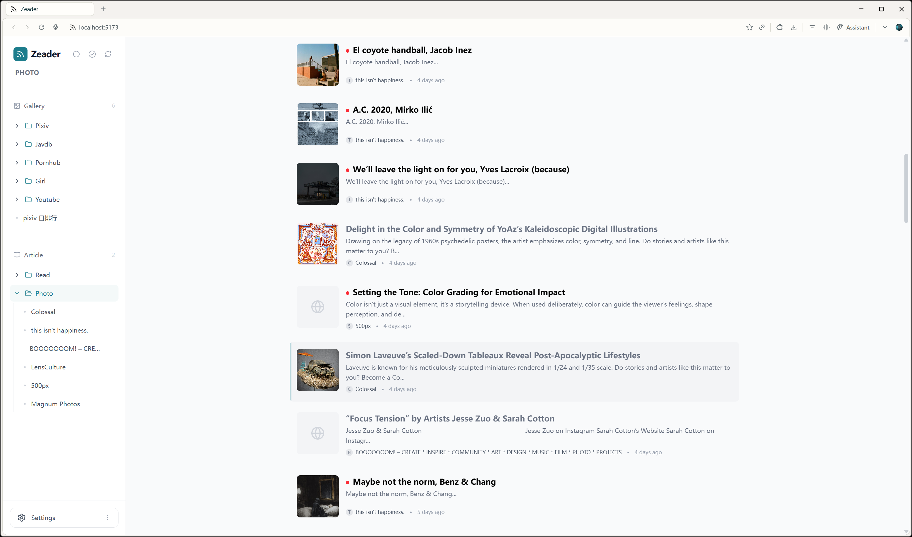

# Zeader RSS Reader

English | [简体中文](./README_zh-CN.md)

A modern, personal RSS reader application built with React and Node.js, designed for privacy, performance, and a great user experience.




## Features

- **Smart Feed Management**: Easily subscribe to RSS/Atom feeds and organize them into custom folders to keep your reading list tidy.
- **Dual View Modes**:
  - **Article View**: A traditional, clean list layout optimized for reading text-heavy articles efficiently.
  - **Waterfall View**: An immersive grid layout perfect for browsing image-centric feeds like art galleries or photography blogs.
- **Privacy First**: All your data is stored locally on your machine using JSON files. No external servers tracking your reading habits—you own your data.
- **OPML Support**: Seamlessly migrate your feed subscriptions from other RSS readers using OPML import.
- **Interactive UI**:
  - **Collapsible Sidebar**: Maximize your reading space with a toggleable sidebar.
  - **Drag & Drop**: Intuitively organize your feeds and folders with drag-and-drop support.
  - **Smooth Animations**: Enjoy a fluid user experience powered by Framer Motion.
- **Keyboard Navigation**: Browse through your feeds and articles without leaving the keyboard.

## Keyboard Shortcuts

Master these shortcuts to navigate Zeader like a pro:

### Global
| Key | Action |
| :--- | :--- |
| `[` | Toggle Sidebar |
| `1` | Switch to Waterfall View (All Gallerys) |
| `2` | Switch to Article View (All Articles) |

### Article View
| Key | Action |
| :--- | :--- |
| `↑` / `↓` | Navigate through the article list |
| `Enter` | Open the selected article |

### Waterfall View
| Key | Action |
| :--- | :--- |
| `↑` / `↓` / `←` / `→` | Navigate through the grid cards |
| `Enter` | Open the selected item |

### General
| Key | Action |
| :--- | :--- |
| `Esc` | Close open modals or details view |

## Tech Stack

- **Frontend**: React 19, Vite, Tailwind CSS v4, Zustand (State Management), Framer Motion, Lucide React.
- **Backend**: Node.js, Express.
- **Data Storage**: Local JSON files.

## Getting Started

### Prerequisites

- Node.js (v16 or higher recommended)
- npm or yarn

### Installation

1. Clone the repository:
   ```bash
   git clone https://github.com/AsleepX/zeader-rss.git
   cd rss-reader
   ```

2. Install dependencies:
   ```bash
   npm install
   ```

### Running the Application

Start both the backend server and the frontend development server with a single command:

```bash
npm run dev
```

- Frontend will be available at `http://localhost:5173`
- Backend API runs on `http://localhost:3001`

## Project Structure

- `src/`: Frontend React application.
- `server/`: Backend Express server and file storage logic.
- `data/`: Local data storage (feeds and cached articles).

## License

MIT
