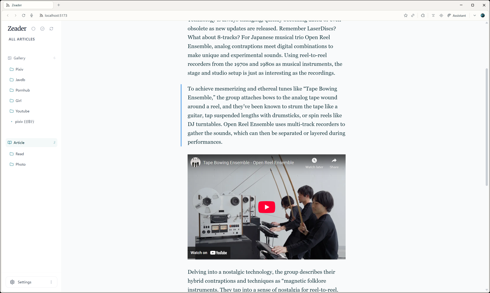
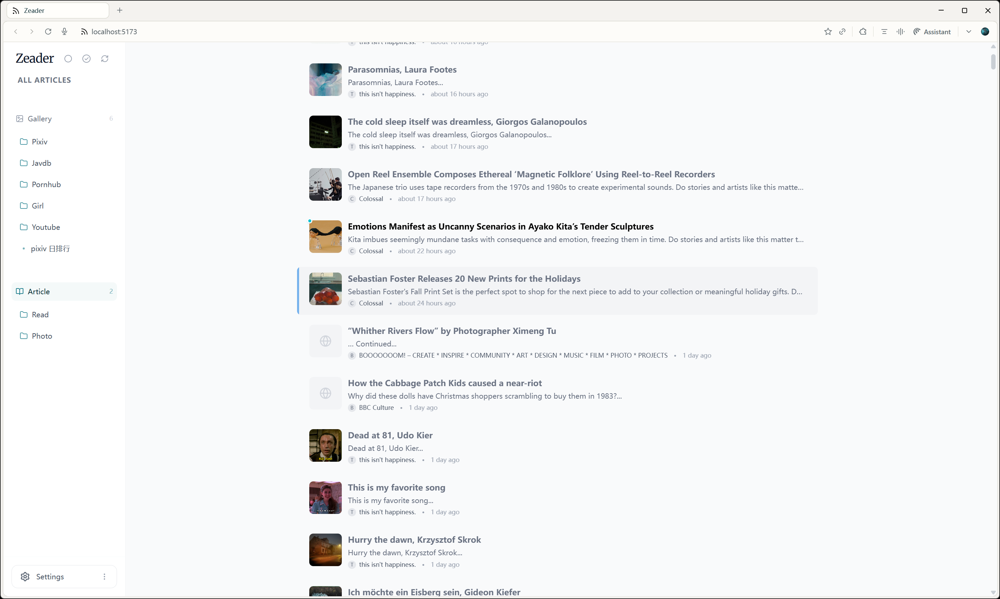

# Zeader RSS Reader

[English](./README.md) | 简体中文

一个基于 React 和 Node.js 构建的现代个人 RSS 阅读器，专为隐私、性能和卓越的用户体验而设计。






## 功能特性

- **智能订阅管理**: 轻松订阅 RSS/Atom 源，并通过自定义文件夹进行分类管理，保持阅读列表井井有条。
- **双视图模式**:
  - **文章视图**: 传统的列表布局，专为高效阅读文字内容而设计。
  - **瀑布流视图**: 沉浸式的网格布局，非常适合浏览图片为主的订阅源（如插画、摄影博客）。
- **隐私优先**: 所有数据均以 JSON 格式存储在您的本地机器上。没有外部服务器追踪您的阅读习惯——完全掌控您的数据。
- **OPML 支持**: 支持通过 OPML 导入功能，从其他 RSS 阅读器无缝迁移您的订阅列表。
- **交互式界面**:
  - **可折叠侧边栏**: 通过折叠侧边栏最大化您的阅读空间。
  - **拖拽排序**: 支持拖拽操作，直观地整理您的订阅源和文件夹。
  - **流畅动画**: 基于 Framer Motion 构建，提供丝滑的用户体验。
- **键盘导航**: 全键盘支持，让您无需鼠标即可浏览订阅源和文章。
- **AI 智能助手**: 内置 AI 集成，可即时生成文章摘要或解释选中的文本。

## AI 功能

- **Z YAML (瀑布流视图)**: 在画廊模态窗中自动生成结构化的 YAML 信息栏，提取标题、创作者和标签等关键信息。
- **Z Summary (文章视图)**: 打开文章时自动生成包含三句话的精简摘要和标签，助您快速掌握文章核心内容。
- **AI Unread Summary (未读摘要，快捷键: `Z`)**: 智能分析所有未读文章，生成一份综合新闻简报。它会识别文章间的共同主题、趋势和关联，呈现今日要点和独特见解。可点击的引用链接让您直接跳转到相关文章。


## 键盘快捷键

掌握以下快捷键，像专业人士一样使用 Zeader：

### 全局
| 按键 | 动作                        |
| :--- | :-------------------------- |
| `[`  | 切换侧边栏显示/隐藏         |
| `1`  | 切换到瀑布流视图 (所有画廊) |
| `2`  | 切换到文章视图 (所有文章)   |

### 文章视图
| 按键      | 动作                         |
| :-------- | :--------------------------- |
| `↑` / `↓` | 在文章列表中上下导航         |
| `Enter`   | 打开选中的文章               |
| `Space`   | 标记当前为已读并移动到下一篇 |
| `Z`       | AI 未读摘要                  |


### 瀑布流视图
| 按键                  | 动作             |
| :-------------------- | :--------------- |
| `↑` / `↓` / `←` / `→` | 在网格卡片中导航 |
| `Enter`               | 打开选中的项目   |

### 通用
| 按键  | 动作                     |
| :---- | :----------------------- |
| `Esc` | 关闭打开的模态框或详情页 |

## 技术栈

- **前端**: React 19, Vite, Tailwind CSS v4, Zustand (状态管理), Framer Motion, Lucide React.
- **后端**: Node.js, Express.
- **数据存储**: 本地 JSON 文件.

## 本地开发

### 前置要求

- Node.js (推荐 v16 或更高版本)
- npm 或 yarn

### 安装步骤

1. 克隆仓库:
   ```bash
   git clone https://github.com/AsleepX/zeader-rss.git
   cd rss-reader
   ```

2. 安装依赖:
   ```bash
   npm install
   ```

### 运行应用

使用以下命令同时启动后端服务器和前端开发服务器：

```bash
npm run dev
```

- 前端访问地址: `http://localhost:5173`
- 后端 API 运行在: `http://localhost:3001`

## 部署

### 部署到服务器

要在服务器上部署 Zeader，请按照以下步骤操作：

1.  在服务器上**克隆仓库**：
    ```bash
    git clone https://github.com/AsleepX/zeader-rss.git
    cd rss-reader
    ```

2.  **安装依赖**：
    ```bash
    npm install
    ```

3.  **构建前端**：
    ```bash
    npm run build
    ```

4.  **启动服务器**：
    ```bash
    npm start
    ```
    服务器默认将在 3001 端口启动。您可以通过 `http://your-server-ip:3001` 访问应用。

    > **注意**：在生产环境中，后端服务器（端口 3001）会直接提供构建好的前端文件。这与开发模式不同（开发模式下 Vite 使用 5173 端口）。

    *可选*：您可以设置 `PORT` 和 `PASSWORD` 环境变量来自定义端口和启用密码保护。
    ```bash
    export PORT=8080
    export PASSWORD=your_secure_password
    npm start
    ```

### 部署到 Railway

您可以点击下方按钮一键部署 Zeader 到 Railway：

[](https://railway.com/deploy/pCRDAl?referralCode=0OR46e&utm_medium=integration&utm_source=template&utm_campaign=generic)

### 部署到 Zeabur

如果你选择手动部署到 Zeabur，请按照以下步骤操作：

[注册/登录](https://zeabur.com/referral?referralCode=AsleepX)：访问 Zeabur 并使用你的 GitHub 账号登录。

Fork 项目：在本项目 GitHub 页面右上角点击 Fork 按钮，将仓库复制到你自己的账号下。

创建服务：

在 Zeabur 控制台点击 Create Project (创建项目)。

点击 Deploy New Service (新建服务)，选择 Git，然后选中你刚刚 Fork 的 zeader-rss 仓库。

项目配置（关键步骤）： 进入刚刚创建的服务页面，进行以下设置：

持久化存储 (Volumes)：点击 Settings (设置) 标签页 -> Volumes (挂载卷)。点击添加挂载卷：

- 名称：任意填写（例如 zeader-data）。

- 挂载路径：必须填入 /app/data。（这一步是为了确保你的数据不会丢失）。

环境变量 (Variables)：点击 Variables 标签页。

- 键 (Key): PASSWORD

- 值 (Value): 设置你的访问密码。

生成域名：

点击 Networking (域名) 标签页。

点击 Generate Domain (生成域名) 或绑定自定义域名。

访问生成的网址即可开始使用 Zeader！

## 项目结构

- `src/`: 前端 React 应用
- `server/`: 后端 Express 服务器和文件存储逻辑
- `data/`: 本地数据存储（订阅源和缓存文章）。

## License

MIT
